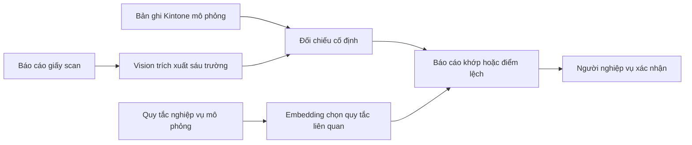

# B-029 — PoC đối chiếu báo cáo thành tích

## Điều PoC cần chứng minh

B-029 hỗ trợ người kiểm tra đối chiếu một báo cáo sản xuất hằng ngày trên
giấy với bản ghi dự kiến trong Kintone. Mục tiêu của PoC là chứng minh ba năng
lực của Local AI Lab có thể phối hợp an toàn:

1. Vision đọc sáu trường trên bản scan.
2. Logic cố định chỉ ra trường khớp hoặc lệch.
3. Embedding tìm các quy tắc cần xem khi người dùng xử lý kết quả.

Kết quả PoC là một báo cáo để **con người xác nhận**, không phải quyết định
tự động thay người phụ trách.



Thiết kế chi tiết, ranh giới an toàn và tiêu chí kỹ thuật nằm tại
[thiết kế B-029](superpowers/specs/2026-09-21-b029-synthetic-poc-design.md).
Tài liệu này là cách giải thích ngắn để trình bày với người nghiệp vụ.

## Phạm vi phiên bản đầu

Phiên bản đầu chỉ dùng dữ liệu mô phỏng. Nó đọc một ảnh PNG/JPEG hoặc PDF scan
một trang, sau đó đối chiếu sáu trường: ngày, lệnh sản xuất, công đoạn, mã
hàng, số lượng thực tế và số lượng lỗi.

Ba trạng thái được trả về có ý nghĩa rõ ràng:

| Trạng thái | Ý nghĩa | Hành động người dùng |
|---|---|---|
| `match` | Sáu trường đọc được và khớp bản ghi mô phỏng | Xác nhận kết quả PoC |
| `mismatch` | Đọc được nhưng có ít nhất một trường khác | Xem bảng điểm lệch rồi xác nhận |
| `needs_human_review` | Ảnh/JSON không đủ tin cậy để đối chiếu | Kiểm tra bản giấy và bản ghi gốc |

Không có trạng thái nào được dùng để ghi ngược vào Kintone. B-029 v1 không gọi
Kintone API, không gửi mail, không in phiếu và không tự đóng nghiệp vụ.

## Cách PoC dùng Local AI Lab

Local AI Lab vẫn chỉ có một cổng API đã xác thực. B-029 là chương trình chạy
phía người dùng hoặc trong instance để gọi hai đường dẫn đang có:

```text
/v1/chat/completions  → Vision trích xuất dữ liệu
/v1/embeddings         → tìm quy tắc liên quan
```

Vì vậy, PoC không mở thêm API public, không phải cài một dịch vụ mới trên Vast
và không thay đổi cách bảo vệ token đang có. Hướng dẫn vận hành inference vẫn
nằm ở [hướng dẫn Vast.ai](vast-ai-first-run.md).

## Chạy demo sau khi gateway đã sẵn sàng

Từ máy có clone repository, chạy một case synthetic qua cùng base URL của
gateway. Khi deploy lại ở máy/instance khác, chỉ thay giá trị `--base-url`;
không sửa code và không thêm `/v1` vào URL.

```bash
uv run local-ai-lab poc b029 run \
  --case samples/b029/cases/case-01.json \
  --base-url https://YOUR-AI-HOST.trycloudflare.com \
  --credential-file secrets/vast-api-token \
  --output reports/b029/case-01
```

Muốn thử PDF synthetic thay vì PNG, thêm `--document pdf`. Thư mục output phải
chưa tồn tại. Kết quả gồm `result.json`, `result.md`, `evaluation.json`; không
chứa ảnh scan, base64 hay credential. `needs_human_review` là kết quả đúng khi
Vision không đủ tin cậy, không phải lỗi process.

## Phân công để demo có ý nghĩa

| Vai trò | Việc cần xác nhận |
|---|---|
| Hiếu / kỹ thuật | Chạy stack AI, chuẩn bị data synthetic, đo thời gian và ghi nhận lỗi |
| Người phụ trách sản xuất | Giải thích ý nghĩa sáu trường và xác nhận điểm lệch thật sự quan trọng |
| Data owner Kintone | Cho phép export mẫu đã ẩn danh và xác nhận mapping trường |
| Security/IT | Phê duyệt nơi chạy dữ liệu thật; dữ liệu nội bộ không được đưa lên Vast khi chưa được duyệt |

## Đường đi từ demo đến pilot

1. Chạy mười cặp dữ liệu synthetic: năm cặp khớp, năm cặp lệch.
2. Xác nhận API, Vision, embedding, báo cáo và đường đi xử lý lỗi hoạt động.
3. Xin bộ mẫu thật đã ẩn danh theo [phiếu yêu cầu dữ liệu](b029-data-request.md).
4. Người nghiệp vụ tạo ground truth; kỹ thuật đo accuracy trích xuất và chất
   lượng phát hiện lệch trên bộ này.
5. Chỉ sau khi data owner và security phê duyệt mới cân nhắc pilot với Kintone
   thật hoặc server nội bộ.

Kết quả synthetic chỉ chứng minh khả năng tích hợp kỹ thuật. Nó không được suy
ra là độ chính xác với chữ viết tay, biểu mẫu thật, hay dữ liệu sản xuất thật.
