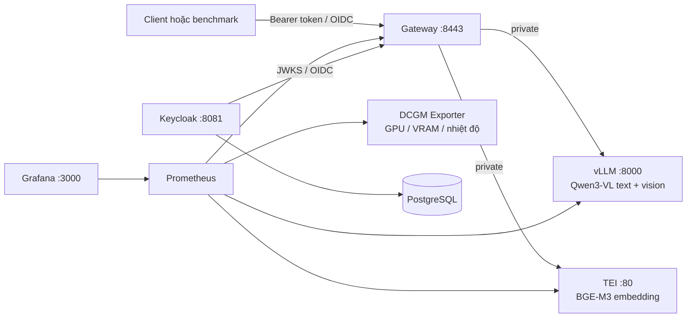

# GPU Stack — hướng dẫn triển khai

## Những gì đã được viết

Stack hiện có sáu phần kỹ thuật:

1. vLLM phục vụ chung text và Vision qua OpenAI-compatible API.
2. Text Embeddings Inference phục vụ BGE-M3.
3. Gateway FastAPI là cổng duy nhất cho client, hỗ trợ service token và OIDC.
4. Benchmark đo TTFT, E2E, TPOT, decoding/output TPS, concurrency, error và GPU samples.
5. Prometheus, Grafana và DCGM Exporter theo dõi service, queue, VRAM, GPU utilization, nhiệt độ và điện.
6. Keycloak + PostgreSQL là profile đăng nhập dành cho lab/pilot.



`llm`, `embedding` và `dcgm-exporter` không publish cổng host. Gateway, Grafana, Prometheus và Keycloak chỉ bind `127.0.0.1`; truy cập từ máy khác qua SSH tunnel. Cấu hình hiện tại chưa phải public HTTPS trên Internet.

Các image ngoài được khóa bằng version và manifest digest; model được khóa bằng Hugging Face revision. Vision chỉ nhận ảnh `data:image/...` hoặc HTTPS từ domain trong `VLLM_ALLOWED_MEDIA_DOMAIN`. Gateway kiểm tra allowlist trước khi proxy, còn vLLM tắt redirect và kiểm tra lại domain để chặn SSRF tới metadata/internal network.

## Chuẩn bị máy Linux GPU

Máy đích cần Linux x86-64, NVIDIA driver, NVIDIA Container Toolkit, Docker Engine và Docker Compose. Profile mặc định dùng Qwen3-VL 8B BF16 với context 8K, concurrency ban đầu là 4 và hướng tới GPU khoảng 32 GB VRAM. TEI image mặc định `120-1.9` dành cho RTX 5090/Blackwell compute capability 12.0; phải đổi image nếu GPU thuê là Ada, Hopper hoặc kiến trúc khác. Nếu model không đạt headroom khi chạy cùng embedding thì dùng 4B làm control hoặc tách embedding sang GPU/CPU khác.

```bash
cd demo
cp config/gpu.env.example config/gpu.env
uv sync --frozen --dev
sudo bash scripts/init_secrets.sh
uv run local-ai-lab stack validate --compose-file compose.yaml --env-file config/gpu.env
docker compose --env-file config/gpu.env --profile monitoring --profile identity config --quiet
```

`init_secrets.sh` cần quyền `root` để gán từng file `0600` cho đúng UID runtime của service. Nếu secret đã tồn tại, script giữ nguyên giá trị và chỉ sửa owner/mode; token không được in ra. Không copy thư mục `secrets/` từ máy phát triển sang server; tạo secret mới trên từng target.

## Chạy stack tối thiểu

```bash
bash scripts/stack.sh up -d --build llm embedding gateway
bash scripts/stack.sh ps
```

Model được tải vào Docker volume `hf-cache`; lần đầu có thể mất nhiều thời gian và bandwidth. Chỉ dùng model ID/revision đã review trong `config/gpu.env`.

Kiểm tra gateway và chạy benchmark text:

```bash
curl --fail http://127.0.0.1:8443/readyz
uv run local-ai-lab bench chat \
  --workload benchmarks/workloads/text.jsonl \
  --credential-file secrets/gateway-token \
  --concurrency 1,2,4,8 \
  --requests-per-level 30 \
  --output reports/text-baseline
```

Benchmark Vision dùng cùng command và workload khác:

```bash
uv run local-ai-lab bench chat \
  --workload benchmarks/workloads/vision.jsonl \
  --credential-file secrets/gateway-token \
  --concurrency 1,2 \
  --requests-per-level 20 \
  --output reports/vision-baseline
```

Benchmark embedding:

```bash
uv run local-ai-lab bench embedding \
  --workload benchmarks/workloads/embedding.jsonl \
  --credential-file secrets/gateway-token \
  --concurrency 1,2,4,8 \
  --requests-per-level 30 \
  --output reports/embedding-baseline
```

Mỗi output chứa `raw.jsonl`, `summary.json` và `summary.md`. Token chỉ được đọc từ file permission `0600`, không truyền trên command line và không ghi vào report.

`summary.json` có error rate và throughput riêng cho từng mức concurrency. Command benchmark vẫn trả exit code `0` khi đã ghi report thành công, kể cả request inference lỗi; pipeline tự động phải kiểm tra `error_rate` theo acceptance gate của experiment.

## Long-context trên Ubuntu VM

Profile mặc định có `LLM_MAX_MODEL_LEN=8192`, vì vậy chỉ chạy workload 8K trên stack hiện tại. Tải một nguồn public trực tiếp vào VM, sinh ba case có marker ở đầu/giữa/cuối context, rồi benchmark tuần tự ở concurrency 1:

```bash
mkdir -p benchmarks/sources benchmarks/generated
curl --fail --location --retry 3 \
  --output benchmarks/sources/war-and-peace.en.txt \
  https://www.gutenberg.org/cache/epub/2600/pg2600.txt

uv run local-ai-lab workload long-context \
  --source benchmarks/sources/war-and-peace.en.txt \
  --source-id war-and-peace-en \
  --output benchmarks/generated/war-and-peace-8192.jsonl \
  --context-windows 8192 \
  --positions start,middle,end \
  --reserve-tokens 1024

uv run local-ai-lab bench chat \
  --workload benchmarks/generated/war-and-peace-8192.jsonl \
  --credential-file secrets/gateway-token \
  --concurrency 1 \
  --requests-per-level 3 \
  --timeout 600 \
  --output reports/long-context-8192-5090
```

Xem `reports/long-context-8192-5090/summary.md`: error rate phải là `0%`, còn ba case `start`, `middle`, `end` phải có `pass_rate` 100%. Chỉ sau khi ghi report 8K mới tăng `LLM_MAX_MODEL_LEN`; thay đổi context, concurrency và GPU memory fraction trong những experiment riêng.

## Monitoring

```bash
bash scripts/stack.sh --profile monitoring up -d prometheus grafana dcgm-exporter
```

- Grafana: `http://127.0.0.1:3000`
- Prometheus: `http://127.0.0.1:9090`
- Dashboard: `Local AI Lab / Local AI Overview`
- Alert/runbook: `monitoring/alerts.yml` và `runbooks/`

Benchmark lấy `nvidia-smi` mỗi giây; Prometheus/DCGM giữ chuỗi thời gian liên tục. Nếu GPU runtime không tồn tại, report có `gpu.sample_count = 0` thay vì tạo số liệu giả.

## Đăng nhập OIDC

Service token chỉ dành cho PoC qua SSH tunnel. Để thử login nhân viên/người được mời:

```bash
bash scripts/stack.sh --profile identity up -d keycloak-db keycloak
```

1. Mở tunnel tới cổng 8081 và đăng nhập Keycloak admin bằng secret file trên server.
2. Tạo user, buộc đổi mật khẩu và thêm user vào group `employees` hoặc `operators`.
3. Đổi `GATEWAY_AUTH_MODE=oidc` trong `config/gpu.env` rồi recreate gateway. Issuer public là địa chỉ tunnel `127.0.0.1:8081`, còn gateway lấy JWKS qua hostname private `keycloak`.
4. Client lấy access token bằng Authorization Code + PKCE hoặc Device Authorization.

Realm không chứa user/password/client secret. `start-dev` chỉ dùng trong lab; pilot Internet cần hostname, TLS, MFA policy, backup PostgreSQL và Keycloak production mode.

## Scale

Thay đúng một nhóm biến trong mỗi experiment:

- Vertical: tăng/giảm `LLM_GPU_MEMORY_UTILIZATION`, context hoặc `LLM_MAX_NUM_SEQS`.
- Tensor parallel: đặt `LLM_TENSOR_PARALLEL_SIZE` bằng số GPU dành cho vLLM.
- Tách GPU: đặt `LLM_GPU_DEVICES` và `EMBEDDING_GPU_DEVICES` khác nhau.
- Replica: chạy nhiều gateway/upstream instance có load balancer; không dùng `docker compose --scale llm` rồi coi là đã scale đúng nếu chưa đo routing và queue.

Mọi thay đổi phải tạo report mới và không được promote nếu quality giảm hoặc VRAM headroom dưới ngưỡng đã duyệt.

## Vast.ai và máy on-premise

Docker Compose này dành cho một Linux GPU host/VM có Docker daemon. Vast.ai cung cấp cả custom template (container, không mặc định có Docker daemon) lẫn Ubuntu VM. Ubuntu VM phù hợp với runbook này sau khi `docker --version` và `docker run --gpus all ... nvidia-smi` chạy thành công. Custom template cần một trong hai cách:

- Build một image/template đã chứa các process cần thiết; hoặc
- Chạy vLLM, gateway và benchmark trực tiếp trong instance, còn Prometheus/Grafana chạy ở máy quản lý qua SSH tunnel.

Không thuê offer rồi chạy Compose theo thói quen trước khi biết instance có quyền Docker. Khi chuyển on-premise, có thể chạy nguyên Compose sau khi thay GPU profile, secret và OIDC/TLS production settings.

## Dừng và tránh phát sinh phí

```bash
bash scripts/stack.sh --profile monitoring --profile identity down
```

Trên Vast.ai, `docker compose down` không hủy hợp đồng thuê. Phải tải report cần giữ, sau đó destroy instance/volume trên Vast để ngừng phí storage theo policy ngân sách.
