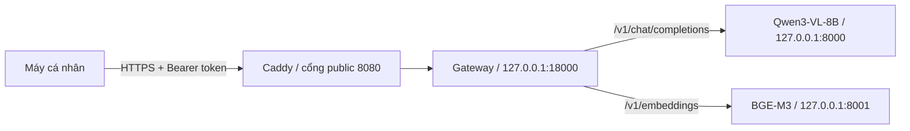

# Vast.ai custom template — hướng dẫn chạy Local AI PoC

Tài liệu này chỉ dành cho **Vast custom template** (image đã build sẵn, không có Docker daemon trong instance). Nếu bạn thuê **Ubuntu VM có Docker**, dùng [GPU Stack](gpu-stack.md) thay thế; không trộn port và token path của hai runbook.

Sau khi hoàn thành, bạn có một HTTPS base URL với hai chức năng:

```text
https://<host>/v1/chat/completions  → Qwen3-VL-8B: text và Vision
https://<host>/v1/embeddings        → BGE-M3: dense embedding
```



Vast instance đã là một container. Không SSH vào đó để cài Docker rồi chạy `docker compose`.

## 1. Chuẩn bị trước khi thuê GPU

Bạn cần:

- Tài khoản Vast.ai đã nạp credit. Tắt autobilling nếu chỉ muốn giới hạn số tiền thử nghiệm.
- Tài khoản GitHub và Docker Desktop đang chạy trên máy phát triển.
- Một SSH key Ed25519.
- Dữ liệu public/synthetic; không gửi tài liệu nội bộ nhạy cảm lên host thuê ngoài.

Tạo SSH key nếu chưa có:

```bash
ssh-keygen -t ed25519 -C "vast-ai-poc"
```

Chỉ copy nội dung file public `id_ed25519.pub`. Không upload hoặc gửi file private `id_ed25519`. Trong Vast Console, mở **Account → Keys → SSH Keys → +New**, dán public key và lưu. Key được tự thêm vào các instance tạo sau đó.

## 2. Build và đẩy image

Image không chứa model weights, token hoặc dữ liệu. Để lần thử đầu đơn giản, đặt GHCR package ở chế độ **public**; Vast có thể pull image mà không cần lưu registry password trong template.

Tạo GitHub personal access token có quyền ghi package, sau đó nhập token bằng prompt ẩn:

```bash
cd /Users/phamhieu/Project/ichi-projects/no13/demo
read -r -s -p "GitHub package token: " ghcr_token
printf '\n'
printf '%s' "${ghcr_token}" | docker login ghcr.io --username YOUR_GITHUB_USER --password-stdin
unset ghcr_token
```

Đổi `YOUR_GITHUB_USER` thành username viết thường rồi build/push image linux/amd64:

```bash
image_ref=ghcr.io/YOUR_GITHUB_USER/no13-local-ai-vast
docker buildx build \
  --platform linux/amd64 \
  --file deploy/vast/Dockerfile \
  --tag "${image_ref}:2026-09-15.1" \
  --push \
  .
```

Trong GitHub, mở package vừa tạo → **Package settings → Change visibility → Public**. Image chỉ có source/runtime; model được tải từ Hugging Face khi instance chạy lần đầu.

Ghi lại digest ngay sau khi push:

```bash
docker buildx imagetools inspect "${image_ref}:2026-09-15.1"
```

Lưu dòng `Digest: sha256:...` vào báo cáo lần chạy và không push đè tag này. Base image trong Dockerfile đã khóa digest; custom image chỉ được coi là tái lập đầy đủ sau khi digest của lần build cũng đã được ghi lại.

## 3. Tạo private template trên Vast.ai

Mở **Templates → My Templates → Create New Template** và nhập:

| Trường | Giá trị |
|---|---|
| Name | `no13-local-ai-single-domain` |
| Image Path:Tag | `ghcr.io/YOUR_GITHUB_USER/no13-local-ai-vast:2026-09-15.1` |
| Launch mode | `SSH` |
| Direct SSH | Bật |
| Recommended disk | `100 GB` |
| Visibility | Private |
| On-start script | Để trống |

Docker options (cổng `1111` dành cho trang quản trị Instance Portal; cổng `8080` dành cho AI API):

```text
-p 1111:1111 -p 8080:8080 -e PORTAL_CONFIG='localhost:1111:11111:/:Instance Portal|localhost:8080:18000:/:Local AI API' -e LLM_MODEL=Qwen/Qwen3-VL-8B-Instruct -e LLM_REVISION=0c351dd01ed87e9c1b53cbc748cba10e6187ff3b -e LLM_GPU_MEMORY_UTILIZATION=0.72 -e LLM_MAX_MODEL_LEN=8192 -e LLM_MAX_NUM_SEQS=4 -e EMBEDDING_MODEL=BAAI/bge-m3 -e EMBEDDING_REVISION=5617a9f61b028005a4858fdac845db406aefb181 -e EMBEDDING_GPU_MEMORY_UTILIZATION=0.15 -e MODEL_STARTUP_TIMEOUT_SECONDS=1800
```

Không thêm `HF_TOKEN`, `OPEN_BUTTON_TOKEN`, `LOCAL_AI_API_TOKEN` hoặc GitHub token vào trường này. File [`template.json.example`](../deploy/vast/template.json.example) chứa cùng cấu hình nếu sau đó bạn muốn tạo template bằng Vast API.

Hai revision đang khóa của Qwen3-VL-8B-Instruct và BGE-M3 hiện đều public, không gated, nên PoC không cần xin quyền Hugging Face. Chỉ thêm `HF_TOKEN` bằng cơ chế secret của Vast nếu Hugging Face yêu cầu xác thực/rate-limit tại thời điểm chạy; không ghi token vào Docker options.

## 4. Chọn máy GPU

Từ template vừa tạo, chọn **Search offers** và lọc:

- Một GPU, VRAM tối thiểu 32 GB.
- Host **Verified** và reliability cao; ưu tiên trên 99% cho buổi demo.
- Có direct port cho SSH và gateway.
- Disk 100 GB.
- Tổng giá GPU + disk + bandwidth phù hợp ngân sách; hover vào giá để xem breakdown.
- On-demand cho lần đầu để tránh instance bị ngắt như interruptible.

Không chọn chỉ dựa trên tên GPU. Trước khi thuê, ghi lại GPU model, VRAM, driver/CUDA advertised, reliability, network, disk và tổng USD/giờ. Với ngân sách `$1/giờ`, chỉ thuê offer có tổng giá hiển thị không vượt mức đó.

## 5. Khởi động và kiểm tra bên trong instance

Sau khi instance chuyển sang trạng thái running, bấm nút **SSH** trên instance card và copy nguyên lệnh kết nối mà Vast cung cấp. Sau khi đăng nhập:

```bash
nvidia-smi
df -h /workspace
supervisorctl status
```

Ba process mong đợi:

```text
local-ai-embedding
local-ai-llm
local-ai-gateway
```

Theo dõi quá trình tải model:

```bash
tail -f /var/log/portal/local-ai-embedding.log
tail -f /var/log/portal/local-ai-llm.log
tail -f /var/log/portal/local-ai-gateway.log
```

Lần đầu có thể lâu vì phải tải model. Kiểm tra trực tiếp trong instance:

```bash
curl --fail http://127.0.0.1:8001/health
curl --fail http://127.0.0.1:8000/health
curl --fail http://127.0.0.1:18000/readyz
```

`readyz` chỉ trả thành công khi cả Qwen và BGE-M3 đều sẵn sàng.

## 6. Lấy một base URL và token

Trong instance card, bấm **Open** để vào Instance Portal ở cổng quản trị `1111`, rồi mở **Local AI API**. Quick Tunnel của ứng dụng AI cung cấp hostname dạng:

```text
https://four-random-words.trycloudflare.com
```

Đây là **base URL duy nhất cho AI API**; không thêm `/v1/...` khi lưu. Instance Portal có link quản trị riêng, nhưng chat và embedding vẫn dùng chung hostname AI ở trên. Quick Tunnel URL có thể đổi sau khi tạo lại instance.

Vast tạo `OPEN_BUTTON_TOKEN`; gateway đã sao chép token này vào file runtime quyền `0600`. Trên máy cá nhân, dùng đúng IP và SSH port trên instance card để tải thẳng file token, không làm token xuất hiện trên terminal hoặc command line:

```bash
cd /Users/phamhieu/Project/ichi-projects/no13/demo
umask 077
mkdir -p secrets
ssh -p VAST_SSH_PORT root@VAST_INSTANCE_IP \
  'cat /run/local-ai/gateway-token' > secrets/vast-api-token
chmod 600 secrets/vast-api-token
```

Lệnh chỉ chứa đường dẫn file, không chứa giá trị token. Image cũng chuyển token vào lệnh hash Caddy qua stdin và lọc các dòng credential khỏi portal log. Không dùng `echo`, không mở/in file token, và không đặt token trực tiếp trong `curl`, shell history, `.env` hoặc tin nhắn.

Tạo cấu hình client và thay hostname mẫu bằng hostname Quick Tunnel vừa lấy. Hai biến URL phải giữ cùng một giá trị:

```bash
cp config/vast-client.env.example config/vast-client.env
${EDITOR:-vi} config/vast-client.env
uv run local-ai-lab env validate --env-file config/vast-client.env
```

```text
AI_LLM_BASE_URL=https://four-random-words.trycloudflare.com
AI_EMBEDDING_BASE_URL=https://four-random-words.trycloudflare.com
```

File cấu hình chỉ chứa đường dẫn tới credential; token thật vẫn nằm trong `secrets/vast-api-token`.

## 7. Smoke test từ máy cá nhân

```bash
cd /Users/phamhieu/Project/ichi-projects/no13/demo
bash deploy/vast/smoke.sh \
  --base-url https://four-random-words.trycloudflare.com \
  --token-file secrets/vast-api-token
```

Kết quả đúng:

```text
auth: ok
ready: ok
chat: ok
vision: ok
embedding: ok
```

Script xác nhận request thiếu/sai token đều nhận `401`, sau đó thử readiness, text, một ảnh public và embedding. Bearer token nằm trong file cấu hình tạm quyền `0600`, không xuất hiện trên command line hoặc response được in.

## 7.1. Chạy B-029 synthetic qua public API

Sau smoke test, quay lại máy có clone source (không chạy lệnh này trong image
Vast) và dùng cùng base URL + token file. Không thêm `/v1` vào URL:

```bash
cd /Users/phamhieu/Project/ichi-projects/no13/demo

uv run local-ai-lab poc b029 run \
  --case samples/b029/cases/case-01.json \
  --base-url https://four-random-words.trycloudflare.com \
  --credential-file secrets/vast-api-token \
  --output reports/b029/case-01
```

Khi tạo instance mới, chỉ thay `--base-url` bằng Quick Tunnel URL mới. Lệnh gọi
`/v1/chat/completions` (Vision) và `/v1/embeddings` qua gateway đã xác thực,
không mở endpoint/domain mới. Thêm `--document pdf` để dùng PDF synthetic của
cùng case.

Ba file kết quả là `result.json`, `result.md`, `evaluation.json`; không chứa
scan, base64 hay token. Chọn một thư mục `--output` chưa tồn tại. `match`,
`mismatch` và `needs_human_review` đều là kết quả chạy hợp lệ; exit `2` biểu thị
lỗi cấu hình, file, xác thực hay gateway. `evaluation.json` chỉ đánh giá nhãn
synthetic, không phải accuracy của biểu mẫu thật.

## 8. Benchmark hiệu năng

Có hai phép đo khác nhau:

### 8.1 Đo năng lực GPU bên trong Vast

Cách này thu được VRAM, utilization, nhiệt độ và điện từ `nvidia-smi`. Trong phiên SSH:

```bash
cd /opt/local-ai
mkdir -p /workspace/reports

.venv/bin/local-ai-lab bench chat \
  --base-url http://127.0.0.1:18000 \
  --workload benchmarks/workloads/text.jsonl \
  --credential-file /run/local-ai/gateway-token \
  --concurrency 1,2,4 \
  --requests-per-level 10 \
  --output /workspace/reports/text

.venv/bin/local-ai-lab bench chat \
  --base-url http://127.0.0.1:18000 \
  --workload benchmarks/workloads/vision.jsonl \
  --credential-file /run/local-ai/gateway-token \
  --concurrency 1,2 \
  --requests-per-level 5 \
  --output /workspace/reports/vision

.venv/bin/local-ai-lab bench embedding \
  --base-url http://127.0.0.1:18000 \
  --workload benchmarks/workloads/embedding.jsonl \
  --credential-file /run/local-ai/gateway-token \
  --concurrency 1,2,4 \
  --requests-per-level 20 \
  --output /workspace/reports/embedding
```

Mỗi thư mục có `raw.jsonl`, `summary.json` và `summary.md`. Text/Vision report có TTFT, latency và tokens/second; embedding report có latency và throughput; cả hai có GPU samples nếu `nvidia-smi` hoạt động.

### 8.2 Đo độ trễ Internet từ máy cá nhân

```bash
cd /Users/phamhieu/Project/ichi-projects/no13/demo
vast_base_url=https://four-random-words.trycloudflare.com

uv run local-ai-lab bench chat \
  --base-url "${vast_base_url}" \
  --workload benchmarks/workloads/text.jsonl \
  --credential-file secrets/vast-api-token \
  --concurrency 1,2,4 \
  --requests-per-level 10 \
  --output reports/vast-external-text
```

Phép đo ngoài Internet có network/tunnel latency nhưng không lấy được `nvidia-smi` của Vast; `gpu.sample_count` bằng `0` là đúng trong trường hợp này.

## 9. Monitor trong buổi thử

Trong SSH, mở các terminal riêng:

```bash
watch -n 1 nvidia-smi
```

```bash
watch -n 2 supervisorctl status
```

```bash
curl --silent http://127.0.0.1:18000/metrics
curl --silent http://127.0.0.1:8000/metrics
curl --silent http://127.0.0.1:8001/metrics
```

Gateway và model chỉ phát metric trên loopback. Caddy bảo vệ mọi truy cập từ Internet bằng token, vì vậy `/metrics` không mở ẩn danh. PoC Vast chưa chạy Prometheus/Grafana thường trực; stack on-premise trong `compose.yaml` mới chứa bộ monitoring đầy đủ.

## 10. Khi OOM hoặc quá chậm

Chỉ thay một nhóm biến mỗi lần để biết điều gì tạo ra khác biệt:

1. Giảm concurrency benchmark từ `1,2,4` xuống `1,2`.
2. Giảm `LLM_MAX_NUM_SEQS` từ `4` xuống `2`.
3. Giảm `LLM_MAX_MODEL_LEN` từ `8192` xuống `4096`.
4. Giảm hai memory fraction nhưng giữ tổng không quá `0.90`.
5. Nếu vẫn OOM, đổi LLM sang bản 4B làm control hoặc thuê GPU VRAM lớn hơn.

Sau khi đổi template env, tạo instance mới hoặc cập nhật `/etc/environment` rồi restart đúng process. Không tăng cả context, concurrency và memory fraction cùng một lúc.

## 11. Lỗi thường gặp

| Hiện tượng | Kiểm tra | Hành động |
|---|---|---|
| `401` | Token file có đúng `OPEN_BUTTON_TOKEN` không | Sửa file, giữ mode `0600`; không thêm token vào URL |
| `404` | Có dùng đúng `/v1/chat/completions` hoặc `/v1/embeddings` không | Base URL không chứa sẵn `/v1` |
| `502`/`503` | `supervisorctl status` và log model | Đợi model ready hoặc restart process bị lỗi |
| CUDA/driver error | `nvidia-smi` và tag image CUDA 12.9 | Destroy và chọn offer/driver tương thích; không sửa driver tùy tiện trong container |
| OOM | `nvidia-smi`, context, sequences, fractions | Làm tuần tự theo mục 10 |
| Model tải rất lâu | Log, `df -h`, bandwidth | Đợi tải xong; kiểm tra đủ 100 GB disk |
| URL Quick Tunnel cũ không chạy | Mở lại Instance Portal | Lấy hostname mới; dùng Named Tunnel khi cần domain ổn định |
| Không SSH được | Direct port và SSH key trên instance card | Dùng đúng lệnh/port Vast cung cấp; thêm key ở giao diện instance nếu tạo key muộn |

## 12. Tải báo cáo và ngừng phát sinh phí

Từ máy cá nhân, dùng đúng IP và SSH port Vast hiển thị:

```bash
scp -P VAST_SSH_PORT -r \
  root@VAST_INSTANCE_IP:/workspace/reports \
  ./reports/vast-instance
```

Kiểm tra file đã tải về rồi mới thao tác trên Vast:

- **Stop**: dừng GPU nhưng giữ dữ liệu; storage vẫn tính phí.
- **Destroy**: xóa instance và container storage vĩnh viễn; dùng khi thử xong để ngừng phí instance/storage tương ứng.

Không destroy trước khi tải report cần giữ.

## Nguồn chính thức

- [Vast.ai — SSH keys](https://docs.vast.ai/guides/reference/keys)
- [Vast.ai — Creating templates](https://docs.vast.ai/guides/templates/creating-templates)
- [Vast.ai — Instance Portal](https://docs.vast.ai/guides/instances/connect/instance-portal)
- [Vast.ai — Managing instances](https://docs.vast.ai/guides/instances/manage-instances)
- [Vast.ai — Storage](https://docs.vast.ai/guides/instances/storage/types)
- [vLLM 0.29 — BGE-M3 pooling task](https://docs.vllm.ai/en/v0.29.0/models/pooling_models/specific_models/#baaibge-m3)
- [Caddy — hash password qua stdin](https://caddyserver.com/docs/command-line#caddy-hash-password)
- [Hugging Face — Qwen3-VL-8B-Instruct](https://huggingface.co/Qwen/Qwen3-VL-8B-Instruct)
- [Hugging Face — BGE-M3](https://huggingface.co/BAAI/bge-m3)
